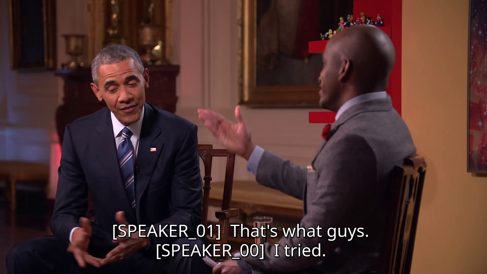
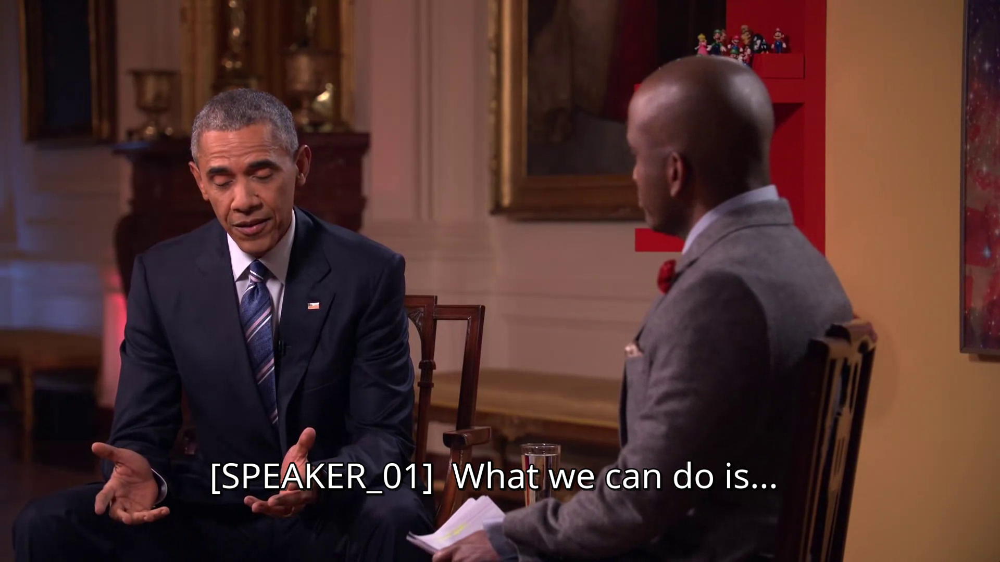
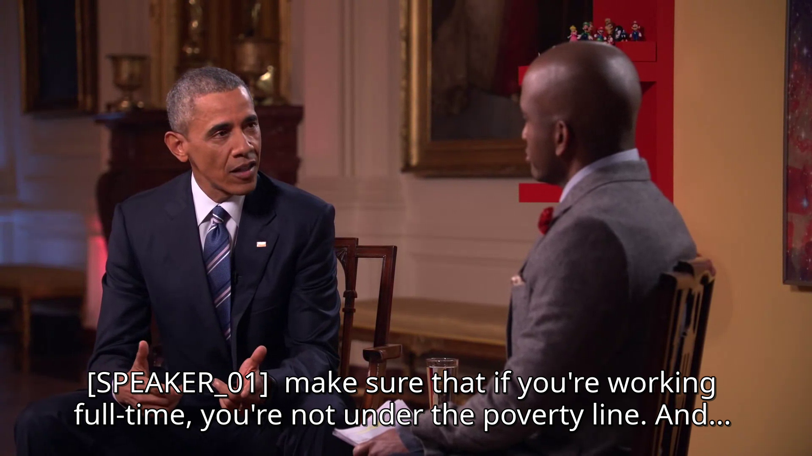

# auto-subtitle
Create srt subtitles for videos automatically.

## Features
- Automatically convert, diarize and transcribe audio
- Generate srt file
- Uses lightweight local models/algorithms, but has easy swap option for heavier ones

## Requirements
- python3.13.3
- ffmpeg

## Example

 
 


## Usage
### Install dependencies
```
python3 -m venv .venv
source .venv/bin/activate
pip install -r requirements.txt
```

### Generate srt
```
python3 src/main.py path_to_video
```

## Credits

Example video:
https://commons.wikimedia.org/wiki/File%3AThe_YouTube_Interview_with_President_Obama.webm
